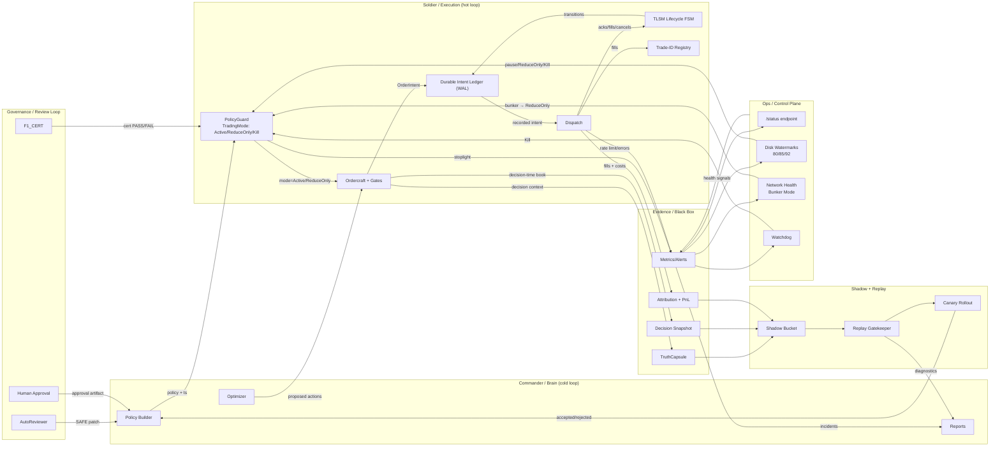

# StoicTrader System Map (Contract-Verified)

> **Source of Truth:** [CONTRACT.md](file:///Users/admin/Desktop/ralph/CONTRACT.md)  
> **Last audited:** 2026-01-15

---

## Categories

### 0) Repository + Verification Harness
**Purpose:** Reproducibility and self-verification  
**Owner:** repo / CI  
**Contract refs:** §0.X, §0.Y (lines 32–76)

- Workspace: `crates/soldier_core`, `crates/soldier_infra` are non-negotiable
- Verification: `plans/verify.sh` → `cargo test --workspace`
- Venue facts: artifacts in `artifacts/`; build fails if evidence check fails

---

### 1) Commander Loop (Planning / Strategy / Improvement)
**Purpose:** Produce policies + improvements; never directly touch the exchange  
**Owner:** Commander (Python)  
**Contract refs:** §5.1–§5.3, §7.1

**Inputs:**
- Evidence from Soldier (TruthCapsules, Decision Snapshots, attribution, incidents)
- Replay/Shadow results

**Outputs:**
- `python_policy` + `python_policy_generated_ts_ms` (for staleness checks)
- Policy patches → must pass Replay Gatekeeper + Canary before live

**Hard gates:**
- Replay Gatekeeper: penalized PnL > 0; fail if `snapshot_coverage_pct < 95%` (§5.2 line 1290)
- Canary rollout: Shadow → Canary → Full; abort triggers rollback + ReduceOnly cooldown (§5.3)

---

### 2) Soldier Hot Loop (Execution + Risk Enforcement)
**Purpose:** Turn proposals into intents; safely execute; contain failures  
**Owner:** Soldier (Rust)  
**Contract refs:** §2.1–§2.4

#### 2.1 Mode & Risk Enforcement
**Output:** `TradingMode = Active | ReduceOnly | Kill`

PolicyGuard precedence (§2.2 lines 688–703):
1. **Kill** if: watchdog heartbeat stale OR `RiskState == Kill`
2. **ReduceOnly** if any:
   - `RiskState == Maintenance`
   - `bunker_mode_active == true` (§2.3.2)
   - F1_CERT missing/stale/FAIL (§2.2.1)
   - EvidenceChainState != GREEN (§2.2.2)
   - `cortex_override == ForceReduceOnly`
   - `exchange_health_state == Maintenance` (§2.3.1)
   - Fee model stale beyond hard limit (§4.2)
   - `RiskState == Degraded`
3. **Active** only if: `RiskState == Healthy` AND policy fresh AND no override

#### 2.2 Microstructure Safety Overrides
- **Cortex** (§2.3): ForceReduceOnly on DVOL shock (≥+10%/60s), spread/depth collapse, WS gap
- **Network Jitter Monitor** (§2.3.2): HTTP p95 > 750ms (3 windows) OR WS lag > 2000ms OR timeout > 2% → ReduceOnly
- **Exchange Health Monitor** (§2.3.1): Maintenance window ≤60min away → ReduceOnly; block opens

---

### 3) Execution & Ordercraft
**Purpose:** Build valid `OrderIntent` with guardrails  
**Owner:** Soldier core  
**Contract refs:** §1.0–§1.5

**Flow (contract-implied):**
1. Preflight guards (order types/capabilities) — §1.4.4
2. Quantization + idempotency labeling/hash — §1.1, §1.1.1
3. Gates (fee/liquidity/net edge/inventory/margin/pending exposure) — §1.3, §1.4.1–§1.4.3
4. Pricer (IOC limit clamp) — §1.4
5. **WAL record BEFORE dispatch** — §2.4
6. Dispatch + lifecycle handling — §1.2

---

### 4) Durability & State Truth
**Purpose:** Never panic, never double-send, survive crashes  
**Owner:** Soldier core + infra  
**Contract refs:** §2.1, §2.4

#### 4.1 TLSM (Trade Lifecycle State Machine)
- States: `Created → Sent → Acked → PartiallyFilled → Filled | Canceled | Failed`
- Never panic on out-of-order WS events; fill-before-ack is valid
- Every transition appended to WAL immediately (§2.1 line 624)

#### 4.2 Durable Intent Ledger (WAL)
- Crash-safe local WAL (Sled or SQLite)
- **Write intent record BEFORE network dispatch** (§2.4 line 787)
- Replay on startup + reconcile with exchange

#### 4.3 Trade-ID Registry
- Persist `trade_id → {group_id, leg_idx, ts, qty, price}` (§2.4 lines 808–820)
- WS fill handler: if trade_id seen → NOOP; else append first, then apply

---

### 5) Evidence & Feedback Loop
**Purpose:** If you can't explain/learn, you don't add risk  
**Contract refs:** §2.2.2, §4.3.2

#### 5.1 TruthCapsule
- **Must be recorded before first dispatch** (RecordedBeforeDispatch)
- Write failure → `RiskState::Degraded` + ReduceOnly; opens blocked (§4.3.2 line 1158)

#### 5.2 Decision Snapshots (REQUIRED)
- Decision-time L2 top-N snapshot linked via `decision_snapshot_id`
- Persistence failure → same as TruthCapsule failure (§4.3.2 line 1180)
- **Must continue even if heavy tick/L2 archives paused** (§5.2 line 1181)

#### 5.3 Writer Isolation
- Hot loop enqueues to bounded queue; writer drains/batches
- **Hot loop must NOT stall on disk I/O** (§4.3.2 line 1162)
- Queue overflow or writer error → `parquet_write_errors` → Degraded/ReduceOnly (§4.3.2 lines 1163–1165)

---

### 6) Shadow, Replay & Self-Improvement
**Purpose:** Improve strategy without training on fantasy  
**Contract refs:** §5.2, §5.3

- **Replay Gatekeeper** depends on Decision Snapshots; HARD FAIL if `snapshot_coverage_pct < 95%` (§5.2 line 1290)
- Disk watermark pause of tick/L2 archives does NOT invalidate replay (uses Decision Snapshots)
- **Canary rollout** stages: Shadow → Canary → Full; abort → rollback + cooldown (§5.3)

---

### 7) Governance + Ops Control Plane
**Purpose:** Control autonomous changes; keep machine safe  
**Contract refs:** §7.0–§7.2

#### AutoReviewer + Human Approval
- SAFE patches auto-apply if replay + canary pass and no incidents (§7.1.3)
- AGGRESSIVE patches require `artifacts/HUMAN_APPROVAL.json` (§7.1.2 line 1452)

#### Incident Loop
- Triggers: atomic naked events, 429/10028, canary abort (§7.1.4)
- Enforces: ReduceOnly cooldown + incident report artifact

#### Disk Watermarks (§7.2 lines 1496–1502)
| Threshold | Action |
|-----------|--------|
| ≥ 80% | Stop heavy tick/L2 archives; continue Decision Snapshots + WAL + TruthCapsule |
| ≥ 85% | Force `RiskState::Degraded` (ReduceOnly) |
| ≥ 92% | Kill switch |

---

## System Diagram

---

## Artifact Routing Table

| Artifact | Written by | Read by | When written | Fail-closed gate |
|----------|------------|---------|--------------|------------------|
| `python_policy` + `python_policy_generated_ts_ms` | Commander | Soldier PolicyGuard | Each policy compute | Staleness → ReduceOnly (§2.2 line 707) |
| `artifacts/F1_CERT.json` | Cert runner | PolicyGuard | Rolling window | Missing/stale/FAIL → ReduceOnly; opens blocked (§2.2.1 line 648) |
| `artifacts/HUMAN_APPROVAL.json` | Human | AutoReviewer | On AGGRESSIVE approval | AGGRESSIVE patch blocked without it (§7.1.2 line 1463) |
| WAL / intent ledger | Soldier infra | Hot loop + recovery | Before dispatch + on TLSM transition | No WAL → no dispatch (§2.4 line 787) |
| `processed_trade_ids` | Soldier infra | WS fill handler | On every fill | Duplicate → NOOP (§2.4 line 813) |
| TLSM transitions | Soldier core | Recovery/reconcile | On every lifecycle event | Append immediately (§2.1 line 624) |
| `truth_capsules.parquet` | Evidence writer | Commander + replay | Before first dispatch | Write fail → Degraded/ReduceOnly (§4.3.2 line 1158) |
| `decision_snapshots.parquet` | Evidence writer | Replay Gatekeeper + Shadow | On dispatch | Fail → same as TruthCapsule (§4.3.2 line 1180) |
| Heavy tick/L2 archives | Archive writer | Replay (optional) | Continuous | Pausable at 80% watermark (§7.2 line 1496) |
| Attribution analytics | Analytics writer | Commander optimizer | On fills | Writer error → ReduceOnly (§4.3.2 line 1165) |
| `daily_review.json` | Daily ops reviewer | AutoReviewer + human | Daily | Includes `policy_hash` (§7.1.5 line 1480) |
| `<ts>_incident.md` | Incident reviewer | AutoReviewer + human | On incident | Forces ReduceOnly cooldown (§7.1.4 line 1472) |
| `/api/v1/emergency/reduce_only` | Watchdog | PolicyGuard | On watchdog trigger | Forces ReduceOnly (§3.2 line 847) |
| `/api/v1/status` | Soldier | Owner/watchdog | On request | Read-only health check (§7.0 line 1395) |
| `disk_used_pct` signals | Ops monitor | PolicyGuard | Continuous | 80/85/92 thresholds (§7.2 lines 1496–1502) |
